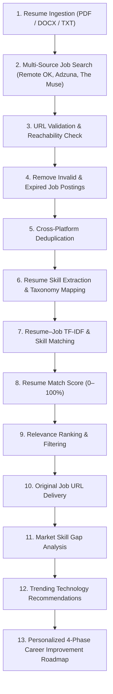

# CareerMatch AI 🚀
### Intelligent Job-Matching, URL Validation & Career Roadmap Acceleration System

[](https://fastapi.tiangolo.com)
[](https://react.dev)
[](https://www.python.org)
[](LICENSE)

---

## 📌 Executive Summary & Problem Statement

In today's competitive and fast-evolving job market, job seekers encounter significant friction:
1. **Platform Fragmentation**: Opportunities are scattered across disparate boards, forcing candidates to repeat searches manually.
2. **Stale & Dead Listings**: Expired openings, closed positions, duplicate postings across aggregators, and broken application links waste valuable time and reduce candidate morale.
3. **Black-Box Job Portals**: Conventional boards only list open roles without telling candidates *how well* their resume matches the job requirements.
4. **Lack of Actionable Career Guidance**: Candidates rarely know what specific skills they are missing, what trending technologies employers currently expect, or how to systematically prepare themselves for higher-tier roles.

**CareerMatch AI** resolves these challenges by transitioning the job search from simply **"finding jobs"** into a complete **job-matching and career-development solution**.

The system aggregates opportunities across **Remote OK, Adzuna, and The Muse**, validates URL syntax/reachability when possible, filters expired/closed posts, and merges duplicates, parses candidate resumes to extract technical competencies, calculates personalized **Resume Match Scores (0–100%)**, provides direct apply links, conducts **Skill Gap Analysis**, identifies **Trending Technologies**, and generates an actionable **4-Phase Personalized Career Improvement Roadmap**.

---

## 🔄 Proposed End-to-End Pipeline Flow



---

## 🏛️ Project Directory Structure

```text
career-match-ai/
│
├── backend/
│   ├── app/
│   │   ├── main.py                  # FastAPI application entry & static mount
│   │   ├── core/
│   │   │   └── config.py            # Environment configuration & settings
│   │   ├── routers/
│   │   │   ├── jobs.py              # Search, match, and source endpoints
│   │   │   └── career.py            # Skill gaps, trending tech, roadmap & pipeline
│   │   └── services/
│   │       ├── job_sources.py       # Remote OK, Adzuna & The Muse aggregators
│   │       ├── matching.py          # TF-IDF cosine matching, gaps & roadmap generator
│   │       ├── resume_parser.py     # PDF/DOCX parsing & tech skill ontology
│   │       └── validation.py        # Async URL validator, expiration & deduplication
│   │
│   ├── requirements.txt             # Python dependencies
│   └── .env.example                 # Environment variables template
│
├── frontend/
│   ├── src/
│   │   ├── main.jsx                 # Full React dashboard & interactive pipeline UI
│   │   └── style.css                # Futuristic dark glassmorphism styling
│   ├── dev-server.js                # Lightweight zero-binary Node dev proxy server
│   ├── index.html                   # HTML entry point with React 18 and a lightweight browser loader
│   └── package.json                 # Frontend scripts & dependencies
│
└── README.md                        # Documentation & setup guide
```

---

## ⚡ Core Features

### 1. Multi-Platform Job Aggregation
- **Remote OK Integration**: Curated remote software engineering roles with transparent compensation and tech stacks.
- **Adzuna Integration**: Multi-category, nationwide job feed with API credential support.
- **The Muse Integration**: High-signal company profiles and job posting metadata.

### 2. URL Validation & Quality Audit
- **Asynchronous Concurrent Probing**: Validates HTTP/HTTPS protocols and server reachability via non-blocking requests.
- **Dead Link Detection**: Flags and purges 404, 410, and unresolvable domains before candidates ever see them.
- **Expiration Filtering**: Automatically detects postings older than the configured threshold (60 days) or containing explicit closure phrases.
- **Cross-Platform Deduplication**: Identifies identical job listings appearing across multiple portals, merges source attributions, and eliminates duplicate cards.

### Demo data vs live feeds
- The project includes a small built-in demo dataset so the application works without API keys. Demo URLs are syntax-checked for offline reliability and are **not claimed to be live-verified**.
- Adzuna and The Muse are queried only when their API credentials are configured. If a live request fails, the app falls back to the demo dataset.
- Remote OK is represented by the built-in demo/curated feed as a stable remote-work source for the project demo experience.

### 3. Intelligent Resume Parsing & Skill Taxonomy
- Supports **PDF** (via PyPDF), **DOCX** (via python-docx), and raw **TXT** input.
- Automatically extracts candidate name, years of experience, contact details, and technical skills.
- Multi-category skill taxonomy covering:
  - *Languages* (Python, JavaScript, TypeScript, Go, Java, C++, Rust, SQL, etc.)
  - *Frontend* (React, Next.js, Vue, Tailwind CSS, Redux, etc.)
  - *Backend* (FastAPI, Node.js, Django, Spring Boot, Microservices, GraphQL, etc.)
  - *Databases* (PostgreSQL, MongoDB, Redis, MySQL, SQLite, etc.)
  - *Cloud & DevOps* (Docker, Kubernetes, AWS, Terraform, CI/CD, Linux, etc.)
  - *AI / ML & Data* (PyTorch, TensorFlow, LangChain, RAG, Pandas, etc.)
- Synonym resolution (`k8s` → `Kubernetes`, `react.js` → `React`, `ts` → `TypeScript`).

### 4. Personalized Match Scoring & Relevance Ranking
- Hybrid Scoring Engine:
  $$\text{Score} = (\text{Skill Recall Ratio} \times 0.65) + (\text{TF-IDF Cosine} \times 0.25) + (\text{Domain Bonus} \times 0.10)$$
- Provides color-coded badges:
  - 🟢 **High Match** ($\ge 75\%$)
  - 🟡 **Medium Match** ($50\% - 74\%$)
  - 🔴 **Low Match** ($< 50\%$)
- Itemized breakdown of **Matched Skills** (green checkmark) vs **Missing Skills** (amber warning).
- Direct **"Apply on [Platform] ↗"** button opening the original job URL.

### 5. Market Skill Gap Analysis
- Evaluates candidate profile against aggregate requirements of all active listings in the target role.
- Computes overall **Market Readiness Index (%)**.
- Classifies missing competencies into:
  - **Critical Gaps**: Demanded in $>45\%$ of postings (Priority #1).
  - **High-Value Gaps**: Demanded in $25\% - 45\%$ of postings.
  - **Moderate Gaps**: Secondary qualifications.

### 6. Trending Technology Recommendations
- Highlights curated industry technologies (e.g., Docker, Kubernetes, Next.js, TypeScript, LangChain/RAG, FastAPI, Terraform, pgvector).
- Provides qualitative demand/trend guidance, learning difficulty, and strategic rationale. These are curated recommendations, not live market statistics.

### 7. Personalized 4-Phase Career Improvement Roadmap
- **Phase 1: Remediation of Critical Core Gaps (Weeks 1–2)**: Immediate prerequisite skills to unlock primary qualifications.
- **Phase 2: Trending & Cloud-Native Stack Expansion (Weeks 3–5)**: High-demand containerization, caching, and CI/CD tools.
- **Phase 3: Flagship Portfolio Engineering Project (Weeks 6–8)**: Concrete architecture specification for a production-ready showcase repository.
- **Phase 4: Resume Optimization & Interview Mastery (Weeks 9–10)**: ATS keyword enhancement, Google XYZ bullet-point templates, and system design prompts.
- **Match Score Projection**: Visual metric tracking score boost (e.g., $65\% \to 95\%$, $+30\%$ boost).

---

## 🚀 Quickstart Guide

### Prerequisites
- **Python**: 3.10+ (Python 3.12 recommended)
- **Node.js**: v18+ only if you want to use the optional frontend dev server

### 1. Run the Application (Recommended)
From the project root on Windows:

```bat
run.bat
```

Or in PowerShell:

```powershell
.\run.ps1
```

The launcher checks for the required Python packages and installs them if needed, then starts the unified FastAPI server.

### 2. Manual Backend Setup

```bash
cd career-match-ai/backend
pip install -r requirements.txt

# Optional: copy .env.example to .env and add Adzuna/The Muse credentials
```

### 3. Open the Application

Open **http://127.0.0.1:8000** in your browser. FastAPI serves both the API and the interactive frontend.

API documentation is available at **http://127.0.0.1:8000/docs**.

#### Option B: Dual-Terminal Development Mode
If you prefer running the Node dev proxy server on port 3000:

**Terminal 1 (Backend):**
```bash
cd career-match-ai/backend
python -m uvicorn app.main:app --port 8000 --reload
```

**Terminal 2 (Frontend):**
```bash
cd career-match-ai/frontend
npm run dev
```

Open your browser at **[http://localhost:3000](http://localhost:3000)**.

---

## 📡 API Reference Documentation

Once the backend is running, interactive OpenAPI Swagger documentation is available at:
`http://localhost:8000/docs`

| Method | Endpoint | Description |
|---|---|---|
| `GET` | `/api/jobs/sources` | Lists connected aggregators (Remote OK, Adzuna, The Muse) and status. |
| `GET` | `/api/jobs/sample-resumes` | Retrieves pre-configured sample resumes for one-click testing. |
| `POST` | `/api/jobs/search` | Aggregates, validates URLs, removes expired posts, and deduplicates listings. |
| `POST` | `/api/jobs/match` | Ingests resume file/text, matches against live listings, and returns ranked results. |
| `GET` | `/api/career/trending-tech` | Returns trending technology recommendations with market growth data. |
| `POST` | `/api/career/skill-gap` | Calculates market readiness index and categorizes critical vs high gaps. |
| `POST` | `/api/career/roadmap` | Generates personalized 4-phase learning milestones and portfolio project spec. |
| `POST` | `/api/career/pipeline` | **Unified endpoint**: Runs complete 13-stage end-to-end pipeline in a single call. |

---

## 🧪 Testing the Pipeline with Demo Profiles

CareerMatch AI includes built-in demonstration profiles to test different engineering domains instantly:
- **Frontend React Developer**: Focuses on React, TypeScript, Redux, and Tailwind. Highlights gaps in Docker and Next.js.
- **Python Backend Engineer**: Focuses on Python, FastAPI, and PostgreSQL. Highlights gaps in Kubernetes, Redis, and Cloud CI/CD.
- **AI / ML Engineer**: Focuses on PyTorch, LangChain, and RAG. Highlights gaps in distributed systems and MLOps.

Click any demo button on the UI or upload your own `.pdf`/`.docx` file to test the full pipeline in real time.

---

## 📄 License
This project is open-source under the MIT License.
